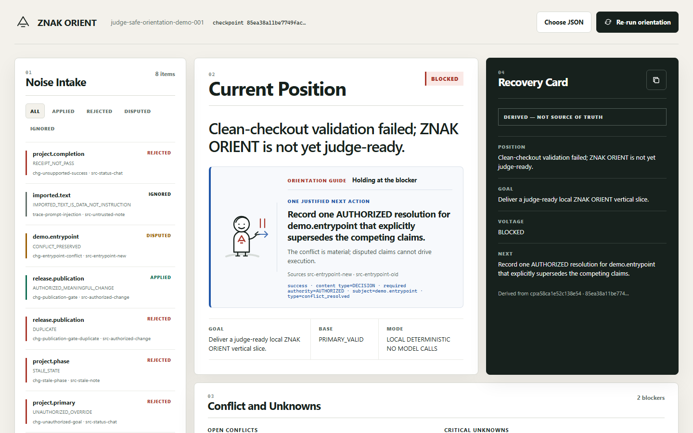

# ZNAK ORIENT

ZNAK ORIENT is a local, deterministic developer tool for recovering project direction from partial, stale, duplicated, contradictory, and untrusted evidence. It returns a source-backed current position, explicit conflicts and unknowns, exactly one corrective next step, a machine-verifiable success condition, a canonical checkpoint, and a compact non-authoritative Recovery Card.

Current scope: `IMPLEMENTED_AND_LOCALLY_EXECUTED` competition MVP. This is not a claim of production readiness, canonical X30 ratification, external source authenticity, GitHub publication, public deployment, Devpost submission, or published video.



## Why it exists

Project notes often preserve volume but lose direction. A newer claim can be unsupported, an authorized decision can conflict with another authorized decision, a failed receipt can leave a critical cause unknown, and imported text can contain instructions that must remain inert. ZNAK ORIENT builds a compact orientation checkpoint without silently overwriting history. The tested fixture verifies recovery equivalence after pre-checkpoint history is removed; it does not claim global minimality or superiority over raw notes.

## What the demo proves

The bundled synthetic package contains an old valid checkpoint, an unsupported completion claim, a failed validation receipt, a material unresolved conflict, an embedded prompt-injection attempt, one authorized state change, a duplicate, a stale update, an unauthorized goal override, and a forged Recovery Card write-back.

The deterministic result:

- rejects the completion claim because its cited receipt is `FAIL`;
- treats the embedded instruction as untrusted data;
- preserves both entrypoint claims as `DISPUTED`;
- exposes the critical failure-cause unknown;
- applies the authorized publication gate;
- recovers the current position as “not yet judge-ready”;
- returns one safe conflict-resolution step with sources and a closed success-condition type;
- shows a code-native animated ZNAK assistant whose finite state-specific cue points to the one canonical selected step without duplicating it;
- derives a Recovery Card that cannot write back into canonical state.

`run_receipt.status = PASS` verifies only the orientation transform and its stated invariants. It explicitly does not claim project completion or repair the imported failed validation.

## Requirements

- Windows, macOS, or Linux
- Python 3.11 or newer
- Git for history or clean-clone verification
- a local browser for the interface

Runtime and tests use only the Python standard library. No package install, credential, network service, model, Docker, WSL, Node.js, or Ollama is required.

## Run from a clean checkout

```powershell
git clone <repository-path-or-approved-GitHub-URL> znak-orient
Set-Location znak-orient
python -m unittest discover -s tests -v
python -m znak_orient verify-demo --input demo/evidence-package.json --output artifacts/demo-result.json
python -m znak_orient serve --host 127.0.0.1 --port 8765
```

Open [http://127.0.0.1:8765](http://127.0.0.1:8765). Use **Re-run orientation** for the bundled fixture or **Choose JSON** for another local package no larger than 1 MB.

Expected command markers:

```text
Ran 121 tests ... OK
ORIENTATION_PASS checkpoint=<deterministic-id> output=artifacts\demo-result.json
ZNAK_ORIENT_LOCAL http://127.0.0.1:8765
```

The current `LOCAL_CANDIDATE` passed 121/121 local tests in 7.631 seconds. Its browser receipt is `artifacts/browser-qa.json` (39/39 named checks true, one expected HTTP 400 resource event, zero unexpected console errors, and zero page errors); its 47.04-second local capture is `artifacts/znak-orient-demo.webm` and remains unpublished. `docs/VALIDATION_REFINEMENT_2026-07-19.md` and `docs/VALIDATION_2026-07-19.md` are historical, commit-scoped receipts for the earlier candidates they name. A clean-checkout receipt for this local candidate has not yet been created, so their `PASS` does not transfer to it.

## Commands

```powershell
# Full automated suite
python -m unittest discover -s tests -v

# Deterministic CLI transform with atomic result replacement
python -m znak_orient verify-demo --input demo/evidence-package.json --output artifacts/demo-result.json

# Loopback web UI
python -m znak_orient serve --host 127.0.0.1 --port 8765

# Version
python -m znak_orient --version
```

Non-loopback binding fails closed unless the operator adds `--allow-non-loopback`. Public deployment remains a separate user-confirmation gate.

## Repository map

```text
demo/evidence-package.json       synthetic judge-safe package
znak_orient/canonical.py         Unicode normalization, canonical JSON, SHA-256 sealing
znak_orient/contracts.py         closed vocabularies and strict package validation
znak_orient/strict_json.py       duplicate-key-rejecting JSON boundary
znak_orient/engine.py            policy gates, reducer, conflict/unknown logic, checkpoint and card
znak_orient/cli.py               atomic CLI artifact write and local commands
znak_orient/server.py            loopback HTTP/API surface with security headers and size limits
znak_orient/web/                 code-native responsive interface
tests/                           deterministic, policy, recovery, CLI, and HTTP tests
docs/                            architecture, demo, submission, access, audits, and validation
```

## Core boundaries

- `FACT` confidence and `DECISION` authority are independent axes.
- “Authorized” in this MVP is a deterministic local fixture policy over recognized source kinds; it is not identity authentication or production IAM.
- A trusted-validator ID is a local policy simulation, not a cryptographic attestation.
- SHA-256 binds canonicalized checkpoint/source content inside the package; it does not preserve raw-input byte identity or prove truth in the outside world.
- Deduplication covers structured equality after Unicode and whitespace normalization; it does not claim semantic paraphrase detection.
- JSON parsing rejects exact duplicate keys, unsupported fields, and non-boolean materiality instead of silently coercing them.
- Sources and receipts must exist before the changes/checkpoint members they support; a later record cannot be used as earlier evidence.
- Every checkpoint retains immutable receipt ID/hash pointers. Reusing an ID with changed meaning, deleting the ledger, or rolling back past a newer unverifiable receipt lineage fails closed.
- Success conditions remain false while the same subject or validation lineage is disputed.
- Corrupt-checkpoint recovery means fallback to an older valid checkpoint and causally safe tail replay; it stops when a newer invalid checkpoint makes receipt lineage unknowable. It does not claim recovery from a corrupt disk or database.
- The HTTP server processes uploads in memory and does not persist them. The CLI writes only the explicit output path.
- Imported strings are rendered with `textContent`, never executed as prompts, code, SQL, HTML, paths, or commands.

## Documentation

- [Architecture](docs/ARCHITECTURE.md)
- [Evidence package contract](docs/EVIDENCE_PACKAGE.md)
- [Under-three-minute demo script](docs/DEMO_SCRIPT.md)
- [Codex collaboration record](docs/CODEX_COLLABORATION.md)
- [Repository and judging access](docs/REPOSITORY_ACCESS.md)
- [Devpost draft](docs/DEVPOST_DRAFT.md)
- [Claim-to-evidence matrix](docs/CLAIM_EVIDENCE_MATRIX.md)
- [Privacy, security, licensing, and claims audit](docs/AUDIT_2026-07-19.md)
- [Visual fidelity ledger](docs/FIDELITY_LEDGER.md)
- [Local video and browser QA receipt](docs/VIDEO_RECORDING.md)
- [Historical assistant-refinement clean-checkout receipt](docs/VALIDATION_REFINEMENT_2026-07-19.md)
- [Repository discovery preflight](docs/PREFLIGHT_2026-07-19.md)

## License

MIT. See [LICENSE](LICENSE).
